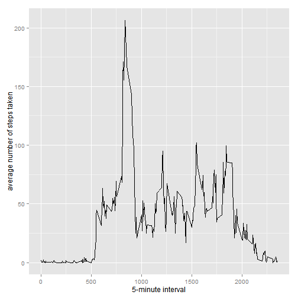

Loading and preprocessing the data

```r
unzip(zipfile="repdata_data_activity.zip")
data <- read.csv("activity.csv")
```

What is mean total number of steps taken per day?

1. Calculate the total number of steps taken per day
2. Make a histogram of the total number of steps taken each day
3. Calculate and report the mean and median of the total number of steps taken per day


```r
library(ggplot2)
total.steps <- tapply(data$steps, data$date, FUN = sum, na.rm = TRUE)
qplot(total.steps, binwidth = 500, xlab = "total number of steps taken per day")
```

 

```r
mean(total.steps, na.rm=TRUE)
```

```
## [1] 9354.23
```

```r
median(total.steps, na.rm=TRUE)
```

```
## [1] 10395
```

What is the average daily activity pattern?

1. Make a time series plot (i.e. type = "l") of the 5-minute interval (x-axis) and the average number of steps taken, averaged across all days (y-axis)


```r
library(ggplot2)
averages <- aggregate(x=list(steps=data$steps), by=list(interval=data$interval),
                      FUN=mean, na.rm=TRUE)
ggplot(data=averages, aes(x=interval, y=steps)) +
    geom_line() +
    xlab("5-minute interval") +
    ylab("average number of steps taken")
```

 


2.Which 5-minute interval, on average across all the days in the dataset, contains the maximum number of steps?


```r
averages[which.max(averages$steps),]
```

```
##     interval    steps
## 104      835 206.1698
```

Imputing missing values
Note that there are a number of days/intervals where there are missing values (coded as NA). The presence of missing days may introduce bias into some calculations or summaries of the data.

1. Calculate and report the total number of missing values in the dataset (i.e. the total number of rows with NAs)


```r
missing <- is.na(data$steps)
# How many missing
table(missing)
```

```
## missing
## FALSE  TRUE 
## 15264  2304
```

2. Devise a strategy for filling in all of the missing values in the dataset. The strategy does not need to be sophisticated. For example, you could use the mean/median for that day, or the mean for that 5-minute interval, etc.
All of the missing values are filled in with mean value for that 5-minute interval.

3. Create a new dataset that is equal to the original dataset but with the missing data filled in.


```r
fill.value <- function(steps, interval) {
    filled <- NA
    if (!is.na(steps))
        filled <- c(steps)
    else
        filled <- (averages[averages$interval==interval, "steps"])
    return(filled)
}
filled.data <- data
filled.data$steps <- mapply(fill.value, filled.data$steps, filled.data$interval)
```

4. Make a histogram of the total number of steps taken each day and Calculate and report the mean and median total number of steps taken per day. Do these values differ from the estimates from the first part of the assignment? What is the impact of imputing missing data on the estimates of the total daily number of steps?


```r
total.steps <- tapply(filled.data$steps, filled.data$date, FUN=sum)
qplot(total.steps, binwidth=500, xlab="total number of steps taken each day")
```

 

```r
mean(total.steps)
```

```
## [1] 10766.19
```

```r
median(total.steps)
```

```
## [1] 10766.19
```
Mean and median values are higher after imputing missing data. The reason is that zero's in the original data are replaced with the mean value for that period.

Are there differences in activity patterns between weekdays and weekends?

First, let's find the day of the week for each measurement in the dataset. In this part, we use the dataset with the filled-in values.


```r
weekday.or.weekend <- function(date) {
    day <- weekdays(date)
    if (day %in% c("Monday", "Tuesday", "Wednesday", "Thursday", "Friday"))
        return("weekday")
    else if (day %in% c("Saturday", "Sunday"))
        return("weekend")
    else
        stop("invalid date")
}
filled.data$date <- as.Date(filled.data$date)
filled.data$day <- sapply(filled.data$date, FUN=weekday.or.weekend)
```

Now, let's make a panel plot containing plots of average number of steps taken on weekdays and weekends.


```r
averages <- aggregate(steps ~ interval + day, data=filled.data, mean)
ggplot(averages, aes(interval, steps)) + geom_line() + facet_grid(day ~ .) +
    xlab("5-minute interval") + ylab("Number of steps")
```

 
